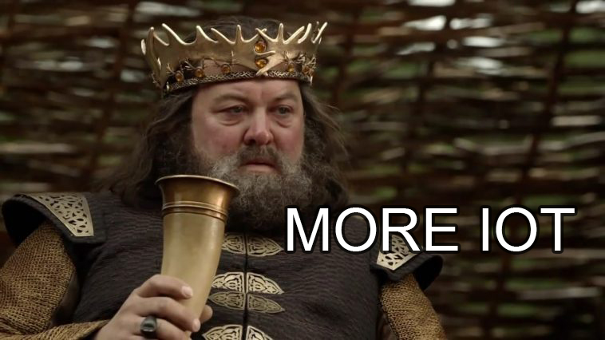

# TalkingChalks

## The second judgement

Professors liked the fact that we defended our work, but they think we didn't exploit much about iot.

We decided to add functionalities to the smartband collecting also the heart rate of the person who wears it. It can be used as an indicator to understand if he liked the artwork or not (more below).

Moreover the scalability we have planned will let to implement more smart features as you can see in the specific section.

## Changes
* As exposed in previus delivery we noticed that our project lacked interactivity so we decided to make visitors part of the museum's art. A new abstract painting is generated everyday by the users while activating the sensors with the smartbands.

* We have added a detailed cost evaluation of the prototype. 
* New functionality included! Smartband now has the ability to read heart rate of the visitor. The heart rate pick of the last few seconds will be sent to the gateway when the NFC tag of a statue is scanned and this will help curators to understand if the statue is appreciated or not. This idea is validated thanks to [this](https://mapping-museum-experience.com/wp-content/uploads/2019/04/Physiological-Correlates.pdf) paper. In addition heart rate is also used to give different shapes to the visitor's "personal" painting.

## Future-Features and Evaluations
