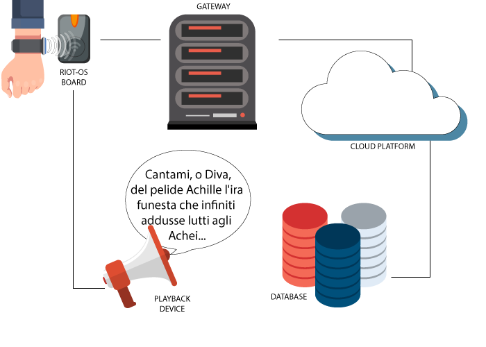

# Architecture

## General
The project is presented in a semi-simulated environment using the [iot-lab.info](https://www.iot-lab.info/) real testbed facility and [RIOT-OS](https://riot-os.org/) to provide a portable and functional application, in this way the whole system is easy replicable and ready to be used.
 The general idea is as follows:

Each visitor is provided with a smartband different for every typology of user that is visiting the museum. Profiles are essential to let the application know the language of the user and the level of detail for the presentation of the artifacts.

Once a visitor with a smartband steps next to a statue, a sensor recognizes the user profile and sends the information to the Cloud through the gateway using [LoRa](https://en.wikipedia.org/wiki/LoRa#LoRaWAN) technology.

The gateway forwards data to the Cloud and sends the material to reproduce to an HiFi System incorporated in the statue, so the user can hear the customized description.

When in the Cloud, data can be stored into a database and they will be ready to be analyzed. 

# LoRaWAN STM Board
[LoRaWAN](https://lora-alliance.org/about-lorawan): Long Range Wide Area Network is a communication protocol with high efficiency peculiarities. LoRaWAN is based on low power consumption and a wide communication range belonging to a technologies category named LPWAN - Low Power Wide Area Network, useful in terms of sensors to use the least energy as possible.
With [iot-lab.info](https://www.iot-lab.info/) in our project we are going to use [B-L072Z-LRWAN1 LoRa Kit](https://www.st.com/en/evaluation-tools/b-l072z-lrwan1.html) programmable using [RIOT-OS](https://riot-os.org/).

Each board based on STM Nucleo system has a beacon/nfc sensor able to identify a smartband's profile and it is also equipped with an Hi-Fi System.

# Smartband
The smartband is the key point of the entire system because it stores the premade user profiles. It also contains a beacon sensor to be identified by the board and some buttons to let people enjoy an interactive tour. The profile ID is sent to the LoRaWAN board and an appropirate guide track will be reproduced.

# The Things Network
[The Things Network](https://www.thethingsnetwork.org/) provides a set of open tools and a global, open network to build an IoT application at low cost.
In our project it is used to register our devices to the network and to let them communicate with the gateway.

# TTN/MQTT Gateway
The Gateway is responsible of the forwarding of the incoming data from The Things Network to the Cloud.

Once running, the Gateway launches a client that subscribes to the TTN's broker at the topic _+/devices/+/up_ using as username the name of the TTN Application and as password the Applocation Access Key.

Data are received from the boards as a json string, then the emitting board is identified by its ID and the payloads are so forwarded using MQTT protocol.

# Hi-Fi System
Simple speakers connected to the LoRaWAN board, the main role of these instruments is to reproduce the requested audio track that explains the statue. They can be connected to the electric system or powered by batteries.

# Cloud
Azure IoT Hub by Microsoft is a managed service hosted in the cloud that acts as a central message hub for bidirectional communication between the IoT application and the device it manages. 

It has a lot of functionalities for all the types of applications, in our project we will use it as MQTT broker to receive messages sent by the devices and store the data in CosmoDB, which is an integrated service.

# Database
Azure CosmoDB is a multi-model database service for any scale. It guarantees a global distribution, high-availability and low latency.

