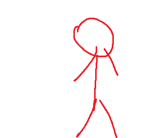

# Design

## PERSONAS

|Maria Concetta Virginia Assunta Esposito|
|:-:| 
|

 Maria Concetta Virginia Assunta Esposito, 40, elementary teacher. In the museum for a guided tour with the children of the elementary school. She is looking for something that keeps children focused on the tour and not taking to each other. She is also looking for something that can describe the statue with more details.|

