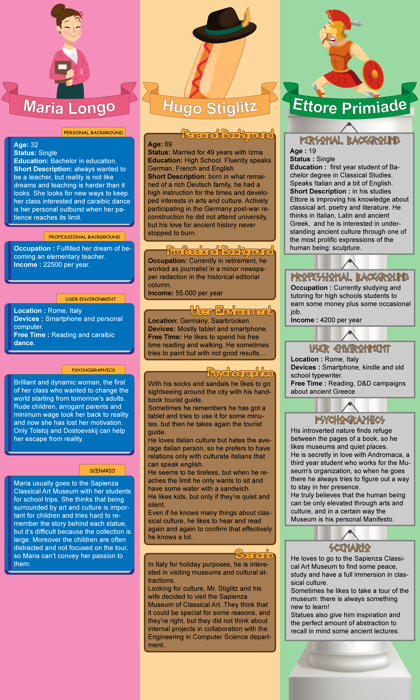
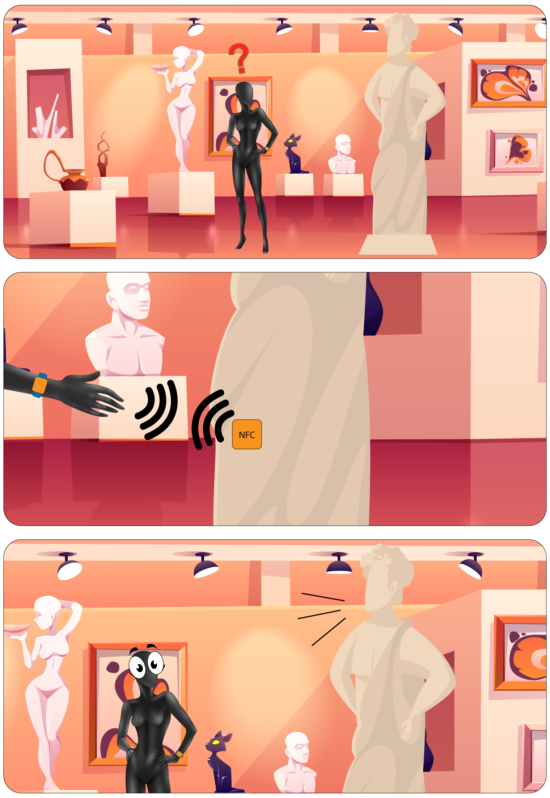

# Design
Many years have passed since the founding of the first museum and things must change sooner or later! The number of visitors is increased and now not only art lovers cross the threshold of museums, someone is even forced! 
Our aim is to provide detailed information on the exhibition while keeping the tour interactive. This makes the museum more attractive and able to entertain even the most lively child disrespectful of classical culture.

## PERSONAS

## STORYBOARD 
Here's a short visual explaination on how the final user will interact with our service.  
Each visitor will be provided with a smartband different for every visitor category (see personas).
Approaching the band to the sensor reader near the most important statues, an audio description different for every type of user will be played out from a speaker.

Note: NFC sensor has only an illustrative purpose and may change during development.
