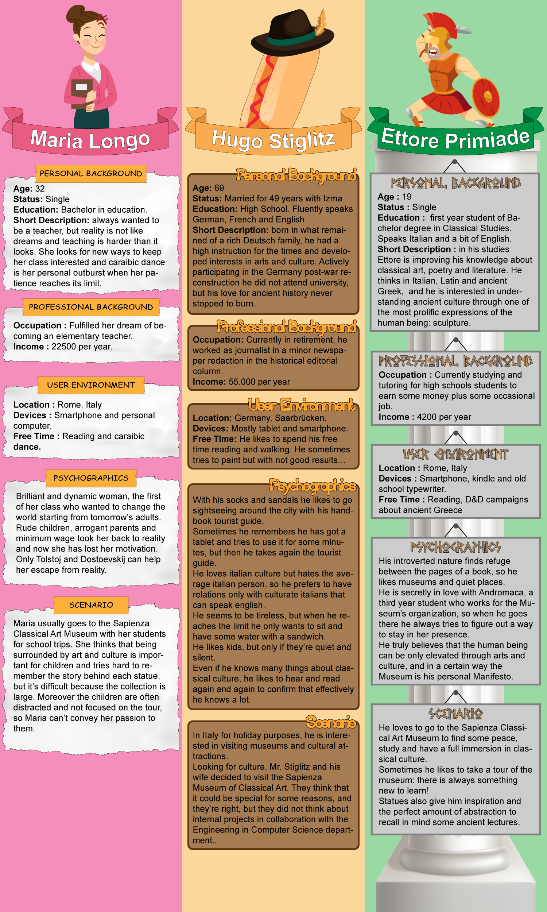

# Design
Many years have passed since the founding of the first museum and things must change sooner or later! The number of visitors is increased and now not only art lovers cross the threshold of museums, someone is even forced! 
Our aim is to provide detailed information on the exhibition while keeping the tour interactive. This makes the museum more attractive and able to entertain even the most lively child disrespectful of classical culture.

## Personas

## User Profiles

### Hugo Profile

#### Subject
Destined for amateur passionate people who want to have an easy cultural trip in the museum. This profile is for medium level people that like classical culture and are interested in hearing a discrete amount of information about the story of the statue and technical details.

#### Quantity of information
x x x o o - 3 out of 5 stars
 Some mythology, discrete quantities of information about the original sculpture and some information about the chalk reproduction.

#### Depth of information
x x x o o - 3 out of 5 stars
 The user is not interested in too many technical details that are provided in a superficial way, but mostly in hearing interesting stories, easier to remember and to appreciate.
Well accepted fun facts and curious things about the story and the statue.

#### Attention required
x x x o o - 3 out of 5 stars
 Because the user is supposed to be personally interested in this kind of art but he is also on vacation we are interested in creating an audio track that can result endearing but not boring.
However the user is supposed to be able to understand some basic historical and artistic steps, so we can think that he will be able to maintain a good level of attention and it will be possible to use an appropriate language.

#### Entertainment
No interaction is expected in this kind of profile but only hearing what statues have to tell.

#### Audio duration
From 3 to 4 minutes.

### Ettore Profile

#### Subject
This profile is perfect for bachelor students but also for high school last year classes of classicals and arts students.
The student in a museum is usually full of energy  and curiosity and he is fresh of academic information: the expected profile is expected to be of a medium high level to fulfill the student's hunger for knowledge.

#### Quantity of information
x x x x o - 4 out of 5 stars
 Information is full of mythological, historical and artistic details about the real statues and the reproductions. 

#### Depth of information
x x x x o - 4 out of 5 stars
 Technical details are important to give the student a confirmation of his knowledge: the information can go deep using historical references, dates, events. Every kind of information is useful to give the user a 360 degrees story of the statue.
The less complete aspect will be the scientific one about the chemicals and physics of the chalk reproductions.

#### Attention required
x x x x x - 5 out of 5 stars
 The required level of attention is expected to be very high: this profile corresponds to someone who can understand and appreciate what lies in front of him, so we can think he truly wants to learn something. That’s why with an user like this is possible to go a little bit beyond to give him a full immersion experience - that will be certainly appreciated.

#### Entertainment
No interaction is expected in this kind of profile but only hearing what statues have to tell.

#### Audio duration
From 6 to 8 minutes.

### Maria Profile

#### Subject
Designed for elementary school teachers and adults that visit the museum with children.
Children are very curious, but they need a simplified description and they cannot understand technical details.

#### Quantity of information
x x o o o - 2 out of 5 stars
 Information is mostly mythological, but also a bit historical.

#### Depth of information
x o o o o - 1 out of 5 stars
 The only technical part is how the statues are made, but even this is described in a simplified way. The historical background is very superficial and mythological part rules out the inappropriate parts for children.

#### Attention required
x o o o o  - 1 out of 5 stars
 The fundamental parts are remarked many times, so that every child can get them. The required attention is not very high, but only the most attentive children can answer all the questions of the interactive game. 

#### Entertainment
For children there is also an interactive game. The talking statue will ask some questions during the visit and the children must press the right button on the bracelet to answer them.

#### Audio duration
About 5 minutes.

## Storyboard
Here's a short visual explaination on how the final user will interact with our service.  
Each visitor will be provided with a smartband different for every visitor category (see personas).
Approaching the band to the sensor reader near the most important statues, an audio description different for every type of user will be played out from a speaker.

Note: NFC sensor has only an illustrative purpose and may change during development.
