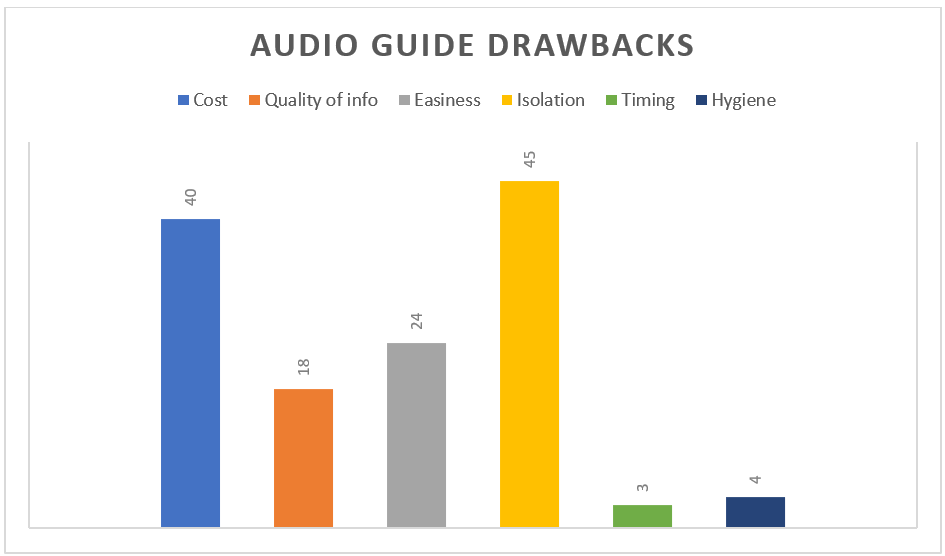
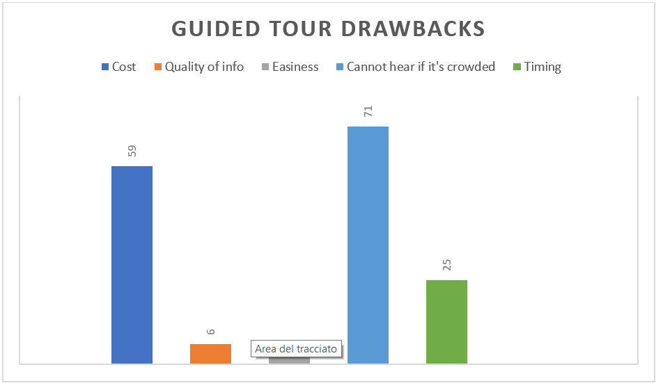
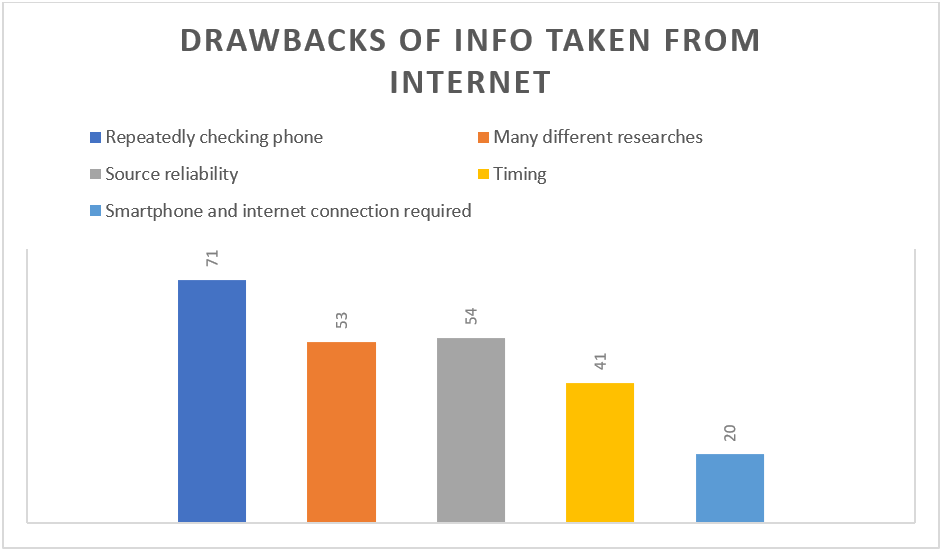
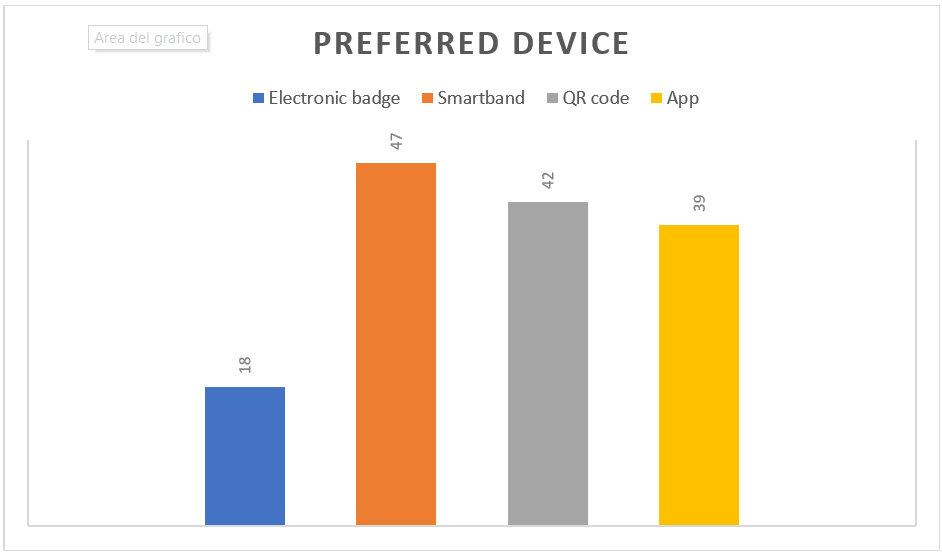

# Evaluation
Link to the [First Version](https://github.com/PanK0/TalkingChalks/blob/master/Evaluation/version1.md) and [second version](https://github.com/PanK0/TalkingChalks/blob/master/Evaluation/version2.md)

## Why TalkingChalks
TalkingChalks is born for the course of [IoT](http://ichatz.me/Site/InternetOfThings2020) @ Sapienza University of Rome.

During a conference with the curators of the Sapienza Museum of Classical Art we found out that they needed di some systems to give some freshness to the Museum. Among the requestes and the ideas it came out that they do not have audio guides, and so we invented TalkingChalks to help the Museum giving some attractiveness for users by letting the statues - literally - talk.

Here is TalkingChalks.

## TalkingChalks objectives
* Provide customized information on the tour for every typology of user
* Full immersion on the tour
* **Simplicity**: easy-to-use and ready-to-use
* Everyone can use it, even elder people, because no smartphone and no internet connectiont are required
* **Source reliability**: info are provided by the museum 
* **Scalability**: the whole application has been designed to be scalable, both for the developers and for the users.

## Scalability 

The whole application has ben designed to be scalable, both for the developers and for the users. Let's see in details. 

### Scalability for users
Our choices are not made by chance: we designed an application that could work using smartbands and lora boards because we are lefting opened a possibility to change and upgrade the whole system.

Using smartbands means that we can implement a lot of functionalities: with BLE we can modify our application to let people to have a greater and magic experience. This technology also permits us to set up an entire new system based on proximity with less effort and maximum result. 

We want to let us opened the possibility of integrate health-safety options: in this new era after the pandemic, it could be useful for users to have an implementation that tells them if they are too close to each other while enjoying the museum. This solution is being adopted by the majors museums of the world using something similar to our project. Well, we are thinking smart: our purposes go over and take care of your health without ruining your visit at the museum. 

With our solution we can also le statues interact with smartphone apps or other facilities in the museum: smart systems of donations and founding, user tracking and data collecting are only a few things that we could implement in TalkingChalks.

That's why we have choosen smartbands and lora boards: what we are building now can be something totally new and fresh tomorrow.

Trust us, we are by your side.

### Scalability for developers
"We exist". 

Not only end user parts of the application are  important, but also maintenance and code easiness: cause of our scalability purposes, the main word of our coding style is **malleability**.

We have designed our code ready to be upgraded: it is sectorized and divided in pieces, all automathized and scalable. With few clicks you can add new devices, with few changes you can transform the network.

We have a sort of "two factors authentication", made to be able to go out TTN: for now everything is secure and safe because we are trusting TTN, but what if we want to go out in a personalized lora network? We can! And we can do it without fear, because we thought with scalability in mind.

Also our boards are quick to setup to be ready to run: few commands and it's possible to test our product without problems.

We made it, you will use it, everyone will be able to repair it.

## Survey
### First survey
[Italian version](https://forms.gle/jZ4fBaXa6VDhBdABA) and [English one](https://forms.gle/cDC3gm15HeV4toPn9).

**Objectives:**
* analyse the habits of museum visitors and divide them in different categories;
* use of the competitors;
* possible difficulties that occur when bringing children to the museum;
* detect if people would like TalkingChalks and why not.

**Results:**
* people prefer audio guides because they are easy-to-use and they can visit the museum on their own
* bringing children to the museum is easy, but not keep them focused on the visit and provide them info

### Second survery
[Italian](https://forms.gle/VDwkLs2pHf6RFf8VA) and [English](https://forms.gle/q8f3F8phV47RapQr8) versions.

**Objectives:**
* identify the weakenesses of the competitors;
* use of the smartphone during the museum tour;
* preferred device(s) to activate TalkingChalks;
* what the museum tours lack in order to add it in a future release;
* detect if people would like and use TalkingChalks and why not.

### Results

where Timing is the timing of the audio descriptions which is too long.

where Timing is the timing is being constrained to the needs of the whole group, which may require too much time.

where Timing is the timing of the interner researches which may require too much time.

**Use of the smartphone during the museum tour:**
* People use their smartphone to take pictures during the tour
* Majority of people doesn't want to use it to look for information, etc.
* Causes isolation

**Preferred devices to activate TalkingChalks:**

Interpreting the data we can conclude that people are more confident with smartbands, but also using QR codes or dedicated apps would be a possibility.

We conducted a second survey with a precise purpose: understand if and how our idea could be helpful for the visitors of the museum.

What we can deduce from the survey is the fact that TalkingChalks can offer a much more complete and satisfying experience for the user in comparison to other TC competitors. 

| Service | Fast | Free | High Quality of information | Customized info | Full immersion on the tour
|:-:|:-:|:-:|:-:|:-:|:-:|
| `TalkingChalks` |✅|✅|✅|✅|✅|
| `Audio Guide` |✅||✅|
| `Museum Guide` |  || ✅|✅|
| `Internet` | |✅|

* **Smartband**
  * easy-to-use
  * smartphone not required
  * no isolation 
  * no distraction given by the smartphone

* **QR code**
  * needs the personal smartphone
  * distraction given by the smartphone

* **App**
  * need the personal smartphone
  * distraction given by the smartphone
  * Main drawback: to download an app that will be used only once.

## Technical evaluation

### LoRaWAN STM Board
* Low power consumption
* Wide communication range

### Smartband
* Easy-to-use and ready-to-use
* No isolation
* **Security**: no access to sensitive data of the users

### Hi-Fi System
* Wired speakers connected to the LoRaWAN board 
* We don't need as many speakers as statues
* Volume not too loud in order to not interpose with the audio description of other statues

### Cloud
* Azure by Microsoft offers many out-of-the-box services that can be easily interconnected
* We are currently using Azure IoT Hub and Azure Database
* If we want to extend our project, we can use other Azure services
* **Azure IoT Hub**
  * With a free subscription and with a standard plan, we can handle a maximum of 8000 messages per day.
 * **Database**
   * Always reachable
   * Guaranteed speed at any scale 
   * No sensitive data stored
   * A "Time to Live" can be specified at the container level to let Cosmos DB automatically delete items after a certain amount of time expressed in seconds.
   * Museum curators can use these data to find out which are the most visited artworks

## Demo
We have built a demo using IoT-Lab, TheThingsNetwork and Azure IoT Hub. The Gateway starts and loads all the registered devices attached to statues..When Lora nodes send a JSON string like _{'dev_id' : 'dev_00', 'profile_id' : 'Hugo', 'hrate' : '72', 'timestamp' : '123'}_, the gateway receives it and looks for the device. If the device is found, then the Gateway assigns the requested profile to it and data are forwarded to the hub and to the database. Each message that the gateway receives contributes to create the abstract painting, generating a circle with the color of the profile and the dimension of the heart rate. During this simulation we have not used speakers: the description of the statue is just a string. Check [this](https://github.com/PanK0/TalkingChalks/tree/master/Demo) for more info.

Here is the [VIDEO](https://youtu.be/zbf5zkPk7X0) of the final demo!

## End user product
We have also built a end user product to practically see how TalkingChalks works.

Here the LoRa Board is graphically simulated by a smartphone and two smartbands are simulated by two distinct NFC tags.
The statue is simulated by an action figure of the famous pokèmon Squirtle. In the [video](https://youtu.be/Zwez2I6sRho) it is possible to see that, when the user passes his smartband [NFC tag] next to the board [Smartphone], the corresponding audio guide is activated. Audio guides are different because the two simulated users have choosen different profiles.

From these two different simulations we can see that as soon as the NFC tag is passed next to the board, the system is activated without delay and all the data are immediately stored into the database.

## Cost Evaluation
We have prepared a cost evaluation for a single device, the museum curators will decide how many devices to use and where to place them. Each device can be placed near a statue so that it can talk, but it's not recommended to place the devices too close, because the speaker of a statue can interpose with the one of another statue.
* **Smartband**
  * We need a configurable smartband with NFC and heart rate detection. This needs to be mass produced.
* **Board**
  * B-L072Z-LRWAN1 is the discovery kit with LoRa module. Price starting from £10, more info on the kit [here](https://www.st.com/resource/en/data_brief/b-l072z-lrwan1.pdf) and for buying it [here](https://www.anglia-live.com/product/1405185001/B-L072Z-LRWAN1/STMICROELECTRONICS).
  * X-NUCLEO-NFC04A1 (€10,75 VAT included)for the NFC tag. More info [here](https://it.farnell.com/stmicroelectronics/x-nucleo-nfc04a1/scheda-espan-tag-dynamic-nfc-rfid/dp/2774141?ost=X-NUCLEO-NFC04A1&CMP=GRHS-1000962).
* **Speakers**
  * We don't need a specific type of speakers with high resolution or extra bass. Common wired speakers cost about €10.
* **Azure**
  * If the number of messages sent to the hub is less than 8000/day and the total number of devices is less than 500, you can use the free plan for the Azure IoT Hub.
  * If the database is always activated, the cost is €194,30 per month. If it is on only during the opening hours (12h a day, 5 days a week), the cost is €64,77 per month.
  * You can calculate the cost in details [here](https://azure.microsoft.com/it-it/pricing/calculator/)
 
## FAQ

#### What is TalkingChalks?
TalkingChalks is an IoT system that can be used in a museum. It can help visitors during the tour providing information about the museum, the statues and the story behind them.

#### How does it work?
TalkingChalks works with special smartbands. They can activate sensors placed in specific points and an audio description of the statue will be played out loud. The audio description changes according to the typology of the smartbands that is activating it. The sensors are activated by smartbands and not by people in proximity because the museum is a noisy environment full of students who study and have classes. Moreover counting how many times sensors have been activated by the smartbands, we can have an overview on the most visited statues of the collection.

#### Why is TalkingChalks different?
TalkingChalks’ innovation is that the tour is more interactive and fun, especially for children. Plus, students from classical studies and from theatre courses could contribute to our project providing the correct information in the best way.

#### Does it answer the needs of the user?
TalkingChalks uses different smartbands to meet everyone’s needs. There is a smartband for people passionate about arts so that they can have detailed descriptions, a smartband for people who are not really interested and want to know the basic information. There is also a smartband for teachers or parents who are visiting the museum with children, so that they can have information in a simplified way. 

#### Why a smartband?
TaklingChalks works with a smartband so that everyone can use it. It is mainly thought for children and elder people, which don’t usually have smartphones or an internet connection.

## Video
Video of the evaluation [here](https://youtu.be/DM_ptuPvxho).
