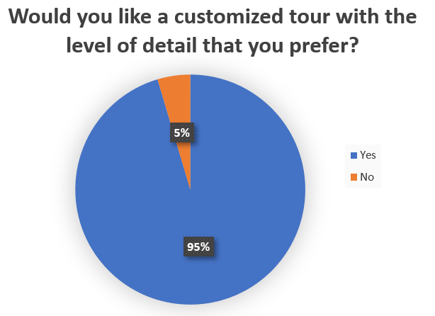
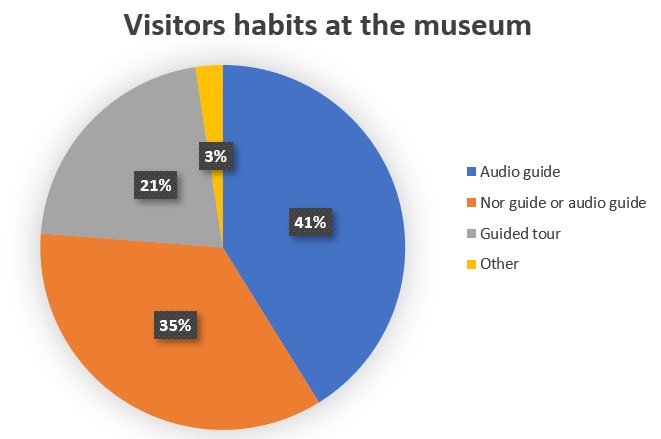

# Evaluation
## Survey
We have carried out a survey to analyse the habits of museum visitors and divide them in different categories. We think that this is useful to understand if people will like TalkingChalks' concept. Many people answered to the [Italian version](https://forms.gle/jZ4fBaXa6VDhBdABA), but there is also an [English one](https://forms.gle/cDC3gm15HeV4toPn9).

 The results of the survey shows that TalkingChalks would be widely accepted by people, because they prefer audio guides and not being limited when visiting a museum. Only 4,5% of people didn't like our idea of a personalized tour, they think that audio guide is already sufficient and they prefer visit the museum alone. Since TalkingChalks consists of a customized audio guide, we can take these results as positive.
 In total 131 people completed our form, 95,4% of them aged from 19 to 65. We tried to collect information from people of every age and habits, but unfortunately we had few answers from elder people, in which we were interested to, and zero answers from children (less than 14 years old).
 Luckily we have received many answers by adults who take children to exhibitions and although taking children to museum is easy, is quite difficult keep the focus on the visit and (sometimes) provide information to the children. In this optic, TalkingChalks would be very useful because it can give children the right information.

 Survey results show that the majority of people use audio guides and even in this case TalkingChalks can be a good option because it is based on audio description. The difference with the typical audio guide is that our audio description will be different for every typology of visiors.

## Technical Evaluation
For the technical evaluation we have performed a simulation of the system. We have created 2 TheThingsNetwork devices, one for each statue. The RIOT-OS app can connect to TTN app using one of the devices created, then randomly selects one of the user profiles and sends it to TTN app. The gateway connects to TTN app, receives the message and prints a different description of the statue depending on the profile. You can check it in [Preliminary_Test folder](https://github.com/PanK0/TalkingChalks/tree/master/Preliminary_Test).

## FAQ

#### What is TalkingChalks?
TalkingChalks is an IoT system that can be used in a museum. It can help visitors during the tour providing information about the museum, the statues and the story behind them.

#### How does it work?
TalkingChalks works with special smartbands. They can activate sensors placed in specific points and an audio description of the statue will be played out loud. The audio description changes according to the typology of the smartbands that is activating it. The sensors are activated by smartbands and not by people in proximity because the museum is a noisy environment full of students who study and have classes. Moreover counting how many times sensors have been activated by the smartbands, we can have an overview on the most visited statues of the collection.

#### Why is TalkingChalks different?
TalkingChalks’ innovation is that the tour is more interactive and fun, especially for children. Plus, students from classical studies and from theatre courses could contribute to our project providing the correct information in the best way.

#### Does it answer the needs of the user?
TalkingChalks uses different smartbands to meet everyone’s needs. There is a smartband for people passionate about arts so that they can have detailed descriptions, a smartband for people who are not really interested and want to know the basic information. There is also a smartband for teachers or parents who are visiting the museum with children, so that they can have information in a simplified way. 

#### Why a smartband?
TaklingChalks works with a smartband so that everyone can use it. It is mainly thought for children and elder people, which don’t usually have smartphones or an internet connection.
