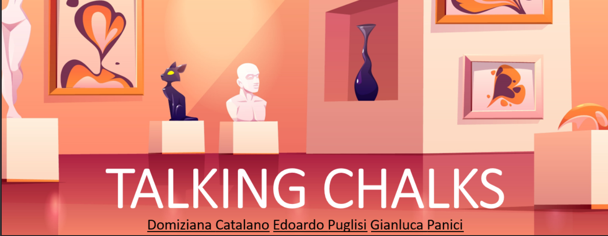

# TalkingChalks
TalkingChalks is an IoT system that can be used in a museum. It can help visitors during the tour providing information about the museum, the statues and the story behind them. 
A smartband with the most suitable profile will be provided to each visitor, so that can everyone can have a customized experience.

## 3rd Delivery
As requested, [HERE](https://github.com/PanK0/TalkingChalks/blob/master/3rd_delivery.md) are the third delivery updates.

## Authors
[Domiziana Catalano](https://www.linkedin.com/in/domizianacatalano/)

[Edoardo Puglisi](https://www.linkedin.com/in/edoardo-puglisi-a79270143/)

[Gianluca Panici](https://www.linkedin.com/in/gianluca-panici-452347146)

## [Design](https://github.com/PanK0/TalkingChalks/blob/master/Design/README.md)
Personas, profiles and storyboards to better understand what we have in mind: we present art with art.

You can check out the [video](https://youtu.be/6nb3dxTIddg) for more information.

## [Architecture](https://github.com/PanK0/TalkingChalks/blob/master/Architecture/README.md)
Short description of the architecture of our project: how the data flow is organized into the system and what technologies we are using.

Here's a [video](https://www.youtube.com/watch?v=5a8aUJ3mY7I&feature=youtu.be) description of the architecture part.

## [Evaluation](https://github.com/PanK0/TalkingChalks/blob/master/Evaluation/README.md)
Evaluation of the entire project: we collected data by sourveying and asking for the needs of the users, so we came out with the idea of TalkingChalks.

Here data are analyzed and interpreted and through the evaluation we decided de feasibility of the project.

Videro [here](https://youtu.be/DM_ptuPvxho).

## [Demo](https://github.com/PanK0/TalkingChalks/tree/master/Demo)
Here is provided the Demo folder containing the essential code and instructions to run our demo.

The Demo shows the behaviour of the gateway receiving data from the lora boards and forwarding the data to the cloud: this is the skeleton of our main product.

How will the final product appear to the user? Take a funny look at our [concept](https://youtu.be/Zwez2I6sRho) clip!

And if you want to give a look to a **more complete product** both from the point of view of the authors and the users, in this [video](https://youtu.be/zbf5zkPk7X0) you can have a more clear idea of what we are *talking* about.

The immature side of the Demo is the [Preliminary Test](https://github.com/PanK0/TalkingChalks/tree/master/Preliminary_Test) section, where we gave a proof of concept of our technical work.

## Presentation
We have prepared a power point [presentation](https://github.com/PanK0/TalkingChalks/tree/master/Presentation).
